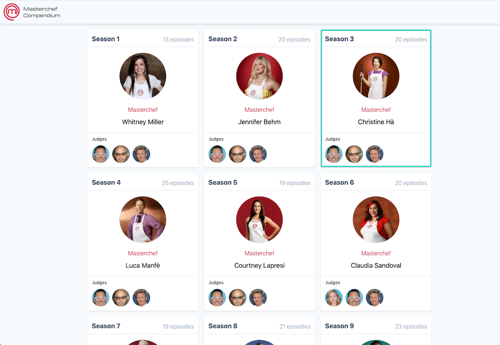

# MCC-API


*Current index of a front-end consumer*

* [Overview](#overview)
* [Requirements](#requirements)
* [Installation and Setup](#installation-and-setup)
* [But Why?](#but-why)

### Note: in very early development

# Overview

An API providing data about the show Masterchef (US). Challenge result data was scraped from [Wikipedia](https://en.wikipedia.org/wiki/MasterChef_(American_season_1)#Elimination_table) and has been transformed into a set of API end-points.

This API was built to serve a front-end, MCC-UI. This is a side project of mine that aggregates episode challenge data with recipe data so that it's navigable and queryable.

The idea is that this data can be mined to answer questions like what cooking technique for salmon has fared the best in all challenges where salmon was presented as a dish. Or what percentage of Italian dishes has Joe Bastianich shit on when judging? How many have truly amazed him and what were they? What is Gordon Ramsay's consistently favored dish across all seasons of MC? Is there one?

# Requirements

* NodeJS v12 or greater
* A local mongodb store

# Installation and Setup

First, clone the project:

```sh
git clone git@github.com:goneplaid/mcc-api.git
cd mcc-api
```

Then install dependencies:

```sh
yarn install
```

After that, rename the config file and configure it for your datastore, then run the seed script:
```sh
mv config/development.json.example config/development.json
yarn run seed
```

Finally, run it:
```sh
yarn start
```

Most of these node scripts have `*-debug` analogs for debugging things in case something goes awry.

# But Why?

I love cooking and have always been fascinated by cooking competition shows, especially Masterchef. I created this in an effort to prepare myself if I ever wanted to sign up as a contestant, which I will probably never, ever do. Basically, if I were to prepare for this show as a contestant, I would want to focus my efforts on practicing recipes, techniques, and ingredients that have been demonstratably successful on the show.


